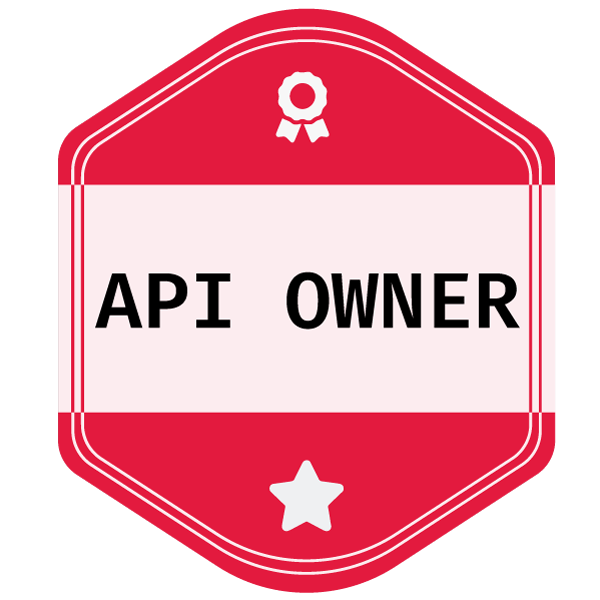

<h1> Hey! Nice to see you.</h1>

        

  

  

  

<h4>Welcome to my page!   I'm Camilo, currently living in <b>Madrid,  Spain</b> . </h4>
<h3>My Tech Stack</h3>

I am a **FULL STACK** developer, passionate about technology and development, with expertise in the **MERN** (MongoDB, Express.js, React.js, Node.js) and **FARM** (FastAPI, React.js, MongoDB) stacks. My day-to-day revolves around overcoming challenges and continually improving through the execution of innovative and enjoyable projects.

In addition to my experience as a Full Stack developer, I am also a developer in artificial intelligence and data engineering. This facet has allowed me to explore the fascinating world of AI, working on ETL processes, data analysis, and the development of ML and DL models.

 

 
<h4>📈 My Github Stats</h4>

 

 

<h2>Certifications 👨🏼‍🎓</h2>

<table>
        <tr>
    <td align="center">
      
      <h5>Google Professional Data Engineer</h5>
    </td>
        <td align="center">
      
      <h5>API Owner</h5>
    </td>
  </tr>
  <tr>
    <td align="center">
      
      <h5>Google Data Analytics</h5>
    </td>
    <td align="center">
      
      <h5>IT Automation with Python</h5>
    </td>
  </tr>
  <tr>
    <td align="center">
      
      <h5>Web Development with HTML, CSS, JavaScript</h5>
    </td>
    <td align="center">
     
      <h5>Cloud Computing Core</h5>
    </td>
  </tr>
</table>

        

